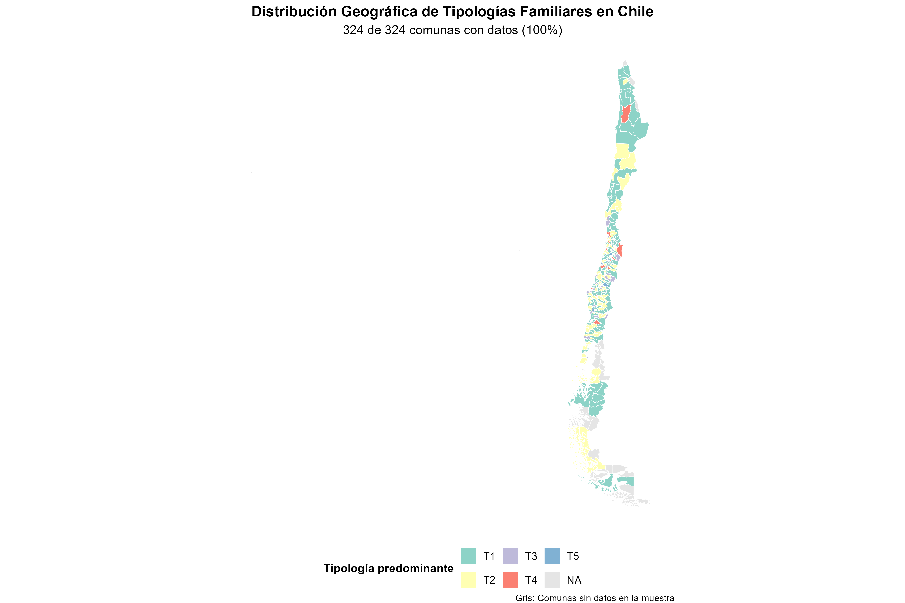
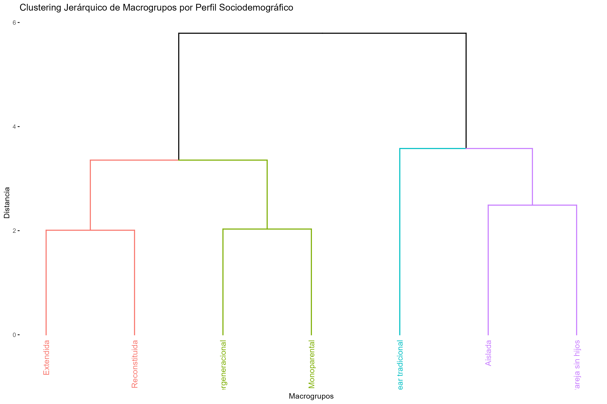
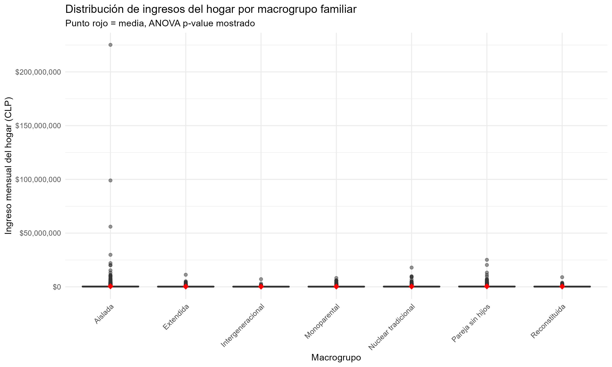

```{r setup, include=FALSE}
# Configuración inicial
knitr::opts_chunk$set(
  echo = FALSE,
  warning = FALSE,
  message = FALSE,
  fig.align = 'center',
  fig.path = "figures/"
)

# Cargar librerías
library(tidyverse)
library(igraph)
library(knitr)
library(kableExtra)
library(FactoMineR)
library(factoextra)
library(patchwork)
library(sf)
library(chilemapas)
library(rstatix)

# Cargar datos
load("Análisis de viviendas/Data/data_macrotiplogias.RData")
load("Análisis de viviendas/Data/data_clusters.RData")
df_final <- read.csv("Análisis de viviendas/Analisis/Resultados_tipologias/clasificacion_tipologias_familiares.csv")
cluster_stats <- read.csv("Análisis de viviendas/Analisis/Resultados_tipologias/estadisticas_clusters.csv")
```

# Resumen de análisis Tipologías y redes

## Hallazgos principales
### Diversidad Estructural Familiar
1. Se crearon *48 tipologías* únicas de redes de parentesco.

```{r tipologias-ejemplo, out.width="100%", fig.cap="Ejemplos de tipologías estructurales"}
# Mostrar las tipologías T1, T2 y T10 como ejemplos
knitr::include_graphics(c(
  "Análisis de viviendas/Analisis/Resultados_Tipologias/Graficos/T1.png",
  "Análisis de viviendas/Analisis/Resultados_Tipologias/Graficos/T2.png",
  "Análisis de viviendas/Analisis/Resultados_Tipologias/Graficos/T10.png"
))
```

De ellos se desprendieron *5 clusters* naturales mediante clustering jerárquico.

Hay *7 macrogupos funcionales* basados en estructura familiar.

### Distribución geográfica
```{r geo}
geo_summary <- data_macro %>%
  group_by(zona) %>%
  summarise(
    n_hogares = n_distinct(household),
    porc_total = round(n_hogares / n_distinct(data_macro$household) * 100, 1)
  )

kable(geo_summary, caption = "Distribución de Hogares por Zona Geográfica") %>%
  kable_styling(bootstrap_options = c("striped", "hover"))
```

```{r geo-map}

```

### Diferencias socioeconómicas significativas
```{r socio}
income_anova <- aov(sueldo ~ macrogrupo, data = data_macro)
tukey_results <- TukeyHSD(income_anova)

# Resumen de ingresos por macrogrupo
income_summary <- data_macro %>%
  group_by(macrogrupo) %>%
  summarise(
    ingreso_mediano = median(sueldo, na.rm = TRUE),
    ingreso_promedio = mean(sueldo, na.rm = TRUE),
    n_hogares = n_distinct(household)
  ) %>%
  arrange(desc(ingreso_mediano))

kable(income_summary, caption = "Ingresos por Macrogrupo Familiar") %>%
  kable_styling(bootstrap_options = c("striped", "hover"))
```

## Metodología

### 1. Identificación de Tipologías
- Fingerprint estructural de las redes de parentesco.
- *48 tipologías* únicas identificadas
- Puntos de quiebre para determinar las tipologías significativas con las que hacer el resto de los análisis.

### 2. Clasificación automática
- *Detección de estructuras familiares:* intergeneracional, monoparental, reconstituida, aislada, nuclear tradicional, pareja sin hijos, extendida.
- *Clustering jerárquico:* con distancia binaria.
```{r dendro}
# Mostrar ambos dendrogramas si están disponibles
  

```

- *5 clusters naturales identificados.*

### 3.Caracterización sociodemográfica
```{r socio_clas}
methods_table <- data.frame(
  "Análisis" = c("Tipologías Estructurales", "Clusters", "Macrogrupos", "Sociodemografía", "Geográfico"),
  "Método" = c("Fingerprinting + Puntos de Quiebre", "Clustering Jerárquico", "Clasificación Automática", "ANOVA + Chi-cuadrado", "Mapas + MCA"),
  "Resultados" = c("48 tipologías", "5 clusters", "7 macrogrupos", "Perfiles sociodemográficos", "Distribución territorial")
)

kable(methods_table, caption = "Resumen de Métodos Utilizados") %>%
  kable_styling(bootstrap_options = c("striped", "hover"))

```

## Resultados
### 1. Clusters de Tipologías Familiares

#### Distribución y características
```{r cluster}
kable(cluster_stats, caption = "Características de los 5 Clusters") %>%
  kable_styling(bootstrap_options = c("striped", "hover")) %>%
  row_spec(which.max(cluster_stats$freq_total), bold = TRUE, color = "white", background = "#2E86AB")
```
- Cluster  1 es el más frecuente (47,1% de casos), y predominan hogares aislados y monoparentales.
- Cluster 2 está conformado por estructuras de matrimonios sin hijos.
- Cluster 3 está conformado por hogares de estructura nuclear tradicional.
- Cluster 4 tiene mayor proporción de estructuras intergeneracionales y presenta también familias reconstituidas.
- Cluster 5 tiene familias extendidas. 

```{r graphic-cluster}
knitr::include_graphics("Análisis de viviendas/Analisis/resultados_cluster/distribucion_clusters.png"
```

*Características sociodemográficas por cluster:*
```{r graph}
# Crear panel con múltiples gráficos
cluster_plots <- list(
  ingresos = "Análisis de viviendas/Analisis/resultados_cluster/ingresos_clusters.png",
  indigenas = "Análisis de viviendas/Analisis/resultados_cluster/presencia_indigenas.png", 
  ruralidad = "Análisis de viviendas/Analisis/resultados_cluster/ruralidad_clusters.png",
  zonas = "Análisis de viviendas/Analisis/resultados_cluster/zonas_clusters.png"
)
# Mostrar los 4 gráficos en un grid
for(plot in cluster_plots) {
  if(file.exists(plot)) {
    knitr::include_graphics(plot)
  }
}
```


### 2. Macrogrupos
#### Perfiles sociodemográficos
```{r socio-perfiles}
macro_profiles <- data_macro %>%
  group_by(macrogrupo) %>%
  summarise(
    n_hogares = n_distinct(household),
    porc_rural = mean(porc_rural, na.rm = TRUE),
    porc_indigena = mean(porc_ind, na.rm = TRUE),
    ingreso_mediano = median(sueldo, na.rm = TRUE),
    edad_promedio = mean(edad.prom, na.rm = TRUE)
  ) %>%
  mutate(porc_total = round(n_hogares / n_distinct(data_macro$household) * 100, 1))

kable(macro_profiles, caption = "Perfiles Sociodemográficos por Macrogrupo") %>%
  kable_styling(bootstrap_options = c("striped", "hover"))
```

```{r boxplot}
# Boxplot de ingresos por macrogrupo
if(file.exists("Análisis de viviendas/Analisis/boxplot_ingresos_macrogrupo.png")) {
  
}
```

### 3. Análisis estadístico
#### Significancia de asociaciones
Chi- cuadrado de los clusters
```{r chi}
# Cargar resultados de chi-cuadrado
chi_summary_clusters <- read.csv("Análisis de viviendas/Analisis/resultados_cluster/chi_summary_clusters.csv")

kable(chi_summary_clusters, caption = "Pruebas Chi-Cuadrado: Clusters vs Variables Sociodemográficas") %>%
  kable_styling(bootstrap_options = c("striped", "hover")) %>%
  row_spec(which(chi_summary_clusters$p_value < 0.05), bold = TRUE, color = "white", background = "#A23B72")
```
Hallazgos Estadísticos:

- Todas las variables muestran asociaciones significativas (p < 0.05)

- Ruralidad y Zona geográfica tienen los mayores efectos (V de Cramer > 0.1)

- Ingresos y composición étnica también presentan patrones diferenciados

### 4. Análisis Multivariado (MCA)
```{r mca}
mca_interpretation <- data.frame(
  "Dimensión" = c("1", "2"),
  "Varianza Explicada" = c("12.8%", "9.3%"),
  "Variables Asociadas" = c("Ruralidad, Ingresos, Zona", "Composición Étnica, Estructura Familiar"),
  "Interpretación" = c("Eje Urbano-Rural con Gradiente Socioeconómico", "Diversidad Cultural y Tipología Familiar")
)

kable(mca_interpretation, caption = "Interpretación de Dimensiones del MCA") %>%
  kable_styling(bootstrap_options = c("striped", "hover"))
```

### 5. Distribución geográfica
#### Patrones teritoriales
```{r patern}
geo_patterns <- data_macro %>%
  group_by(zona, macrogrupo) %>%
  summarise(n = n()) %>%
  group_by(zona) %>%
  mutate(porc = round(n / sum(n) * 100, 1)) %>%
  pivot_wider(names_from = macrogrupo, values_from = porc, values_fill = 0)

kable(geo_patterns, caption = "Distribución de Macrogrupos por Zona Geográfica (%)") %>%
  kable_styling(bootstrap_options = c("striped", "hover"))
```

##Discusiones
### Patrones Emergentes
####1. Gradiente Urbano-Rural
Estructuras nucleares tradicionales predominan en zonas urbanas
Familias extendidas e intergeneracionales más frecuentes en zonas rurales
Correlación con niveles de ingreso y acceso a servicios

####2. Estratificación Socioeconómica
```{r socio-corr}
socioeconomic_correlations <- data_macro %>%
  summarise(
    cor_ingreso_rural = cor(sueldo, porc_rural, use = "complete.obs"),
    cor_ingreso_indigena = cor(sueldo, porc_ind, use = "complete.obs"),
    cor_rural_indigena = cor(porc_rural, porc_ind, use = "complete.obs")
  )

kable(socioeconomic_correlations, caption = "Correlaciones entre Variables Clave") %>%
  kable_styling(bootstrap_options = c("striped", "hover"))
```

#### 3. Diversidad Cultural
- Mayor presencia indígena en estructuras extendidas e intergeneracionales
- Patrones diferenciados por zona geográfica
- Intersección entre etnicidad y estructura familiar

###Implicaciones Teóricas
####Teoría de Estructura Familiar
Las tipologías identificadas reflejan adaptaciones a contextos socioeconómicos
Las estructuras complejas (extendidas) pueden ser estrategias de resiliencia
Existe plasticidad estructural según recursos y oportunidades

####Determinantes Sociales
- Ruralidad como factor estructurante clave
- Recursos económicos que permiten/habilitan ciertas configuraciones
- Factores culturales que mantienen patrones tradicionales

## Conclusiones Principales
La estructura familiar en Chile es diversa y sistemáticamente relacionada con variables sociodemográficas

Existen 5 perfiles claros de clusters familiares con características distintivas

La ruralidad y los ingresos son los principales factores asociados a la variación estructural

Las tipologías muestran distribución geográfica diferenciada con patrones regionales